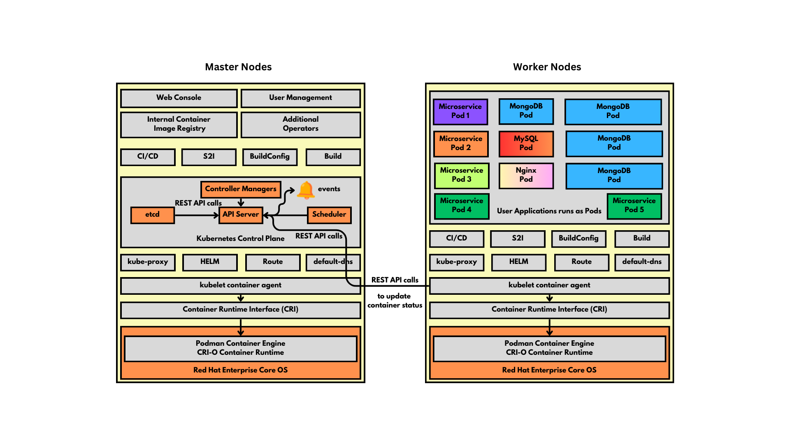

# Day 1

## Hypervisor Overview
<pre>
- is hardware virtualization technology
- this helps us run multiple Operating System on a laptop/desktop/workstation/server
- i.e more than one OS can be actively running on the same machine
- this type of virtualization is considered heavy-weight as each Virtual Machine(VM - Guest OS) requires dedicated hardware resources
  - CPU Cores
  - RAM
  - Storage ( HDD/SDD )
- each VM represents a fully functional Operating System
- the OS that runs within Virtual Machine is referred as Guest OS
- each Guest OS has its own dedicated OS Kernel
- there are two of Hypervisors  
  1. Type 1
  - Bare-Metal Hypervisors
  - Used in Servers & Workstations
  - Virtual Machines(Guest OS) can be created directly on top of hardware with no Host OS requirement
  - Examples
    - VMWare vSphere/vCenter
  2. Type 2
  - used in Laptops/Desktops/Workstations
  - Examples
    - Oracle VirtualBox ( supported in Windows/Linux/Mac OS-X )
    - Parallels ( supported in Mac OS-X )
    - KVM ( supported in all Linux Distributions )
    - VMWare Fusion ( supported in Mac OS-X - Free, earlier it was a paid software, not actively maintained anymore )
    - VMWare Workstation Pro ( was a paid software but now it is Free, works in Linux & Windows )
    - Microsoft Hyper-V
</pre>

## Container Overview
<pre>
- is an application virtualization technology
- each container represents one application
- containers can't run a OS inside it, they can only run a single application
- hence, containers are not a replacement for Hypervisor(Virtualization)
- in practical world, Virtualization and Containerization are used in combination, hence they are complimenting technology and not a competing technology
- is considered light-weight virtualization
- containers running in the Host OS, shares the hardware resources on the underlying Host OS
- containers don't get their own hardware resources
- contianers does'nt have OS Kernel
- containers depend on the Host OS Kernel for any OS functionality
</pre>

## Docker Overview
<pre>
- Docker is developed in Go lang by a company named Docker Inc
- its comes in 2 flavours
  1. Docker Community Edition
  2. Docker Enterprise Edition
</pre>

## High-Level Docker Architecture


## Demo - Installing Docker Community edition in RHEL or Oracle Linux
```
sudo yum install -y yum-utils
sudo yum-config-manager --add-repo https://download.docker.com/linux/rhel/docker-ce.repo
sudo yum install docker-ce docker-ce-cli containerd.io docker-buildx-plugin docker-compose-plugin
sudo usermod -aG docker $USER
sudo systemctl enable docker
sudo systemctl start docker
sudo systemctl status docker
docker --version
docker info
docker images
```

Expected output


## Lab - Download a docker image from Docker Remote Registry to Local Docker Registry
```
docker images
docker pull nginx:latest
docker images
docker pull redis:7.4
docker images
```

Expected output


## Lab - Creating an nginx container
```
docker run -d --name nginx1 --hostname nginx1 nginx:latest
docker ps
docker ps -a
```

Expected output


## Container Image Overview
<pre>
- Container image is template or specification or blueprint of a container
- It is similar to Windows-12-OS-DVD-image.iso 
- Just like how we are able to use windows DVD iso image and install Windows 12 OS on multiple machine, on the similar fashion, using a Container Image one can create multiple containers
- Containers are served by Container Registries
- Examples
  - Ubuntu Container Image ( ubuntu:24.04 )
  - Nginx Container Image ( nginx:latest )
</pre>  

## Container Registries Overview
<pre>
- Docker supports 3 types of Container Registries
  1. Local Docker Registry
  2. Private Docker Registry and
  3. Remote Docker Registry ( Docker Hub Website -  hub.docker.com )
- Local Docker Registry is just a folder, where all the docker images are stored
- Private Docker Registry is server that can be setup using JFrog Artifactory or Sonatype Nexus
- Remote Docker Registry is a website that has a whole lot of Docker Images
</pre>  

## Containers Overview
<pre>
- Container is an instance of one Container Image
- Whatever software tools are present in the Container Image are readily available for use in any container intance
- containers gets its own Private IP address
- containers get its own file system
- containers supports one or more shells
- containers has its own network stack ( 7 OSI Layers )
- containers has its own software defined network cards ( Network Interface Card - NICs )
- each container represents one instance of an application
- containers are not OS
- some containers may appear like a OS, but technically they are just application process that runs in a separate namespace
</pre>  

## Info - Container Runtime
<pre>
- is a low-level software that is used to manage Containers and Images
- it is not so user-friendly, hence end-users generally don't use this directly
- examples
  - runC 
  - CRI-O
</pre>  

## Info - Container Engines
<pre>
- is a high-level software that is used to manage containers and images
- it internally uses Container Runtime to manage containers and images
- it is very user-friendly
- examples
  - Docker 
  - Podman
  - containerd
</pre>  

## Container Orchestration Overview
<pre>
- Container Orchestration platform tools helps us manage our containerized application workloads
- instead of manually creating containers and managing them, we could use Container Orchestration Platforms to manage them for us
- Examples
  1. Docker SWARM - Docker's native Container Orchestration Platform
  2. Google Kubernetes - Free & Production grade Container Orchestration Platform
  3. Red Hat Openshift - Enterprise Paid software - Red Hat's Distribution of Kubernetes
- General features supported
  - provides an environment to make your containerized application works Highly Available (HA)
  - based on traffic to one's application individual applications can be scaled up/down on demand manually/automatically
  - upgrading/downgrading your already live applications from one version to the other without any down time using Rolling update
  - exposing your applications within cluster or to external world using services
- it is a self-healing platform
  - it can repair itself to some extent
  - it can repair your application when it is found faulty
</pre>

## Info - Docker SWARM Overview
<pre>
- this is Docker Inc's Container Orchestration Platform
- it only supports managing Docker containerized application workloads
- it is pretty easy to install and learn
- can be installed on a laptop with pretty basic configuation as well as it is very light weight
- good for POC or learning purpose
- not production grade
</pre> 

## Info - Google Kubernetes Overview
<pre>
- free and opensource container orchestration platform developed by Google along with many open source contributors
- it is production grade
- free for personal and commercial use
- as it is opensource, we won't get support from Google
- only supports command line interface (CLI)
- doesn't support web console
- Kubernetes does provide some basic Dashboard but it is considered a security vulnerability, hence no one uses the Kubernetes Dashboard
- Rancher is opensource webconsole for Google Kubernetes
- Kubernetes supports RBAC, Custom Resource Definition (CRD) to extend the Kubernetes API to add new type of resources
- Kubernetes also allows us to develop and deploy custom operators to manage our custom resources
- Kubernetes operators - is a combination of many Custom Resources + Customer Controllers
- supports inbuilt monitoring features
  - it can check the health of our application, when it finds your application is not responding, it can repair it or replace it with another good healthy instance of your application
  - it supports inbuilt load-balancing
- supports any container runtime/engine as long as there is an implemention of CRI(Container Runtime Interface) to interact with those runtime/engine
</pre>  

## Red Hat Openshift Overview
<pre>
- Red Hat Openshift is developed on top of Google Kubernetes
- supports command line interface and webconsole(GUI)
- supports Role based access control (RBAC), hence multiple users can be created with different level of access to Openshift cluster
- supports many additional features on top of all the Kubernetes features
  1. User Management
  2. Pre-integrated monitoring tools ( Prometheus & Grafana Dashboards )
  3. Out of the box - Private Container Registry
  4. Routes - a new feature only available in Openshift which is developed on top of Kubernetes Ingress
  5. Using the Kubernetes operators, the Red Hat Openshift team has many additional features on top of Kubernetes
- Openshift version upto 3 - supported many different container runtime/engines including Docker
- Openshift version 4 and above - only supports Podman Container Engine and CRI-O Container Runtime
- Due to security vulnerabilities issues in Docker, 
</pre>

## High-Level Openshift Architecture



# Info - Pod Overview
<pre>
- Pod is a collection of related containers
- it is configuration object that is stored and maitained within etcd key-value database by API server
- as per recommended industry best practice, one main application per Pod is better
- Pod is the smallest unit that can be deployed within Kubernetes/Openshift
</pre>


## Info - ReplicaSet Overview
<pre>
- it is a configuration object that is stored and maintained within etcd key-value database by API server
- it tells how many instance of a particular Pod type should be running at point of time
- this configuration object is consumed by ReplicaSet controller
- it the ReplicaSet controller which manages the Pod instances
- the ReplicaSet controller is the one which supports scale up/down
</pre>

## Info - Deployment Overview
<pre>
- stateless applications are normally deployed as a deployment
- it is a configuration object that is stored and maintained within etcd database by API server
- it describes
  - name of the application deployment
  - number of Pod instances expected to be running
  - container image and version that must be used to create Pod
- it supporrs rolling update
- this configuration object is consumed by Deployment Controller
</pre>

## Lab - Checking the openshift tool version
```
oc version
kubectl version
oc get nodes
oc get nodes -o wide
```

## Lab - Creating a Pod in docker 
```
docker images

docker pull gcr.io/google_containers/pause-amd64:3.1

docker images
```

Expected output


## Info - Kubernetes/Openshift Control Plane Components
```
```

