# Day 4

## Info - How to see the values stored inside etcd database?

## Info - What is an Openshift Job?
- any one time activity we can create them as a Job
- Example
  - delete all Persistent Volume which are unused
  - taking backup of etcd database

## Info - What is an Openshift CronJob?
- any recurring activity but that will run for few minutes and terminate we can run them as a CronJob
- Example
  - taking backup of etcd database every Sunday midnight

## Lab - Create a one-time job
```
cd ~/openshift-27may-2024
git pull
cd Day4/job
oc apply -f job.yml
oc get jobs
oc get pods
oc logs job/hello-job
```

Once you are done with the exercise, you may cleanup the resources
```
cd ~/openshift-27may-2024
cd Day4/job
oc delete -f job.yml
```

## Lab - Create a recurring job using Cronjob

```
cd ~/openshift-27may-2024
git pull
cd Day4/cronjob
oc apply -f cronjob.yml
oc get cronjobs
oc get po -w
oc logs cronjobs/cron-job
```

Once you are done with this exercise, you may delete the cronjob
```
cd ~/openshift-27may-2024
cd Day4/cronjob

oc delete -f cronjob.yml
```

## Info - What is DeploymentConfig?
- In older versions of Kubernetes to deploy stateless application we had to use ReplicationController
- In Red Hat they wanted to support declarative style while scaling and while performing rolling update, hence they add a new type of custom resource in OpenShift called DeploymentConfig
- ReplicationController supports both Scaling and rolling update, which is not a good design as it does more than one thing ( against SRP SOLID Design Priniciple )
- DeploymentConfig helps us deploy stateless applications
- Meanwhile, Google refactored the ReplicationController into two resources
  - 1. Deployment - which takes care of Rolling update
    2. ReplicaSet - which takes care of scaling up/down
- As per SOLID Design Priniciples
  - S - Single Responsibility Principle (SRP)
  - O - Open Closed Principle (OCP)
  - L - Liskov Substitution Principle
  - I - Interface Seggration
  - D - Dependency Injection or Dependency Inversion or Inversion of Control (IOC)
- By the Kubernetes added Deployment & ReplicaSet as an alternate to ReplicationController, the OpenShift team already added Deployment Config
- In new versions of OpenShift we would see
  - Deployment & ReplicaSet
  - DeploymentConfig ( this was introduced in openshift when there was no Deployment & ReplicaSet, hence we should avoid using DeploymentConfig instead we should use Deployment )
  - ReplicationController ( old kubernetes features now ideally we should use Deployment )

## Lab - Deploying Angular application from OpenShift Webconsole using Developer context


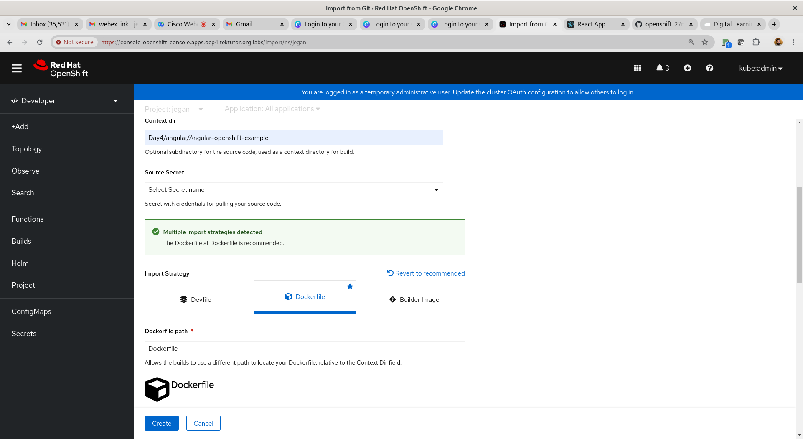
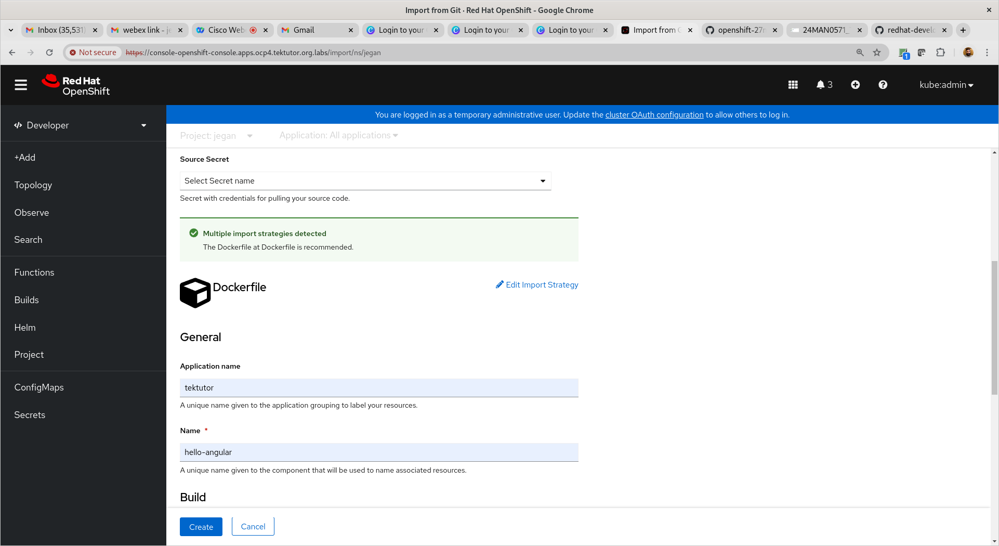

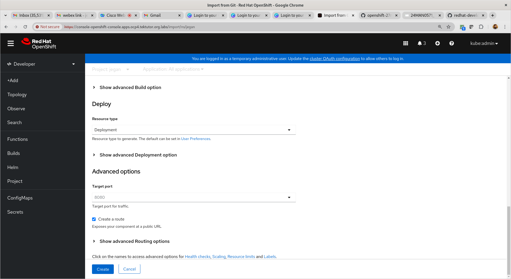
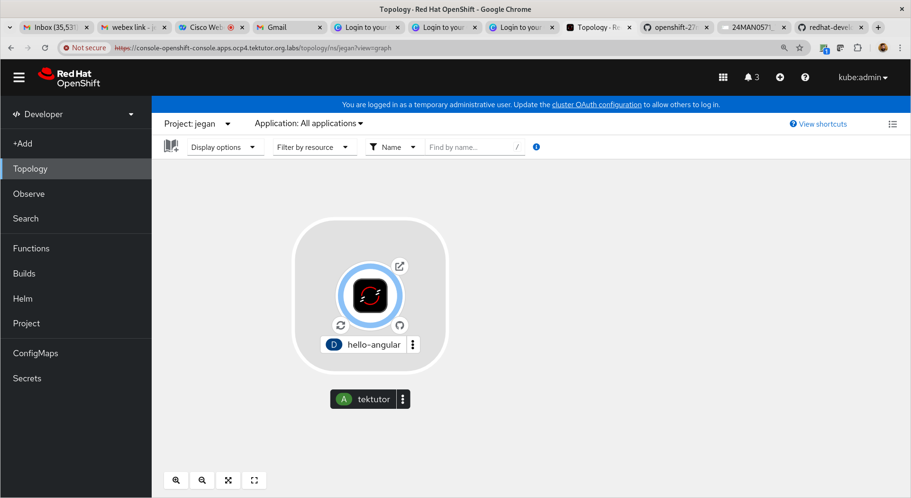
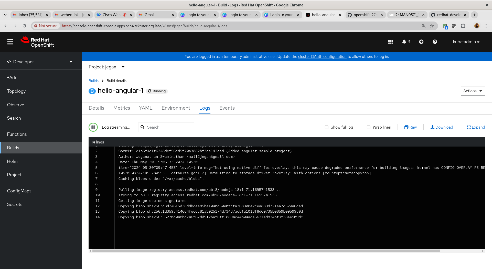

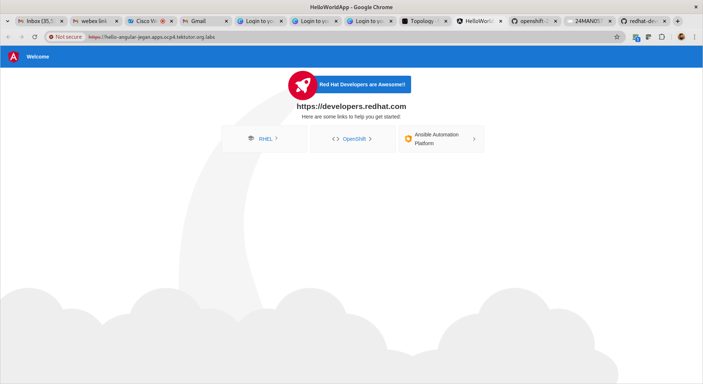

## Lab - Deploying ReactJS application in Openshift from webconsole
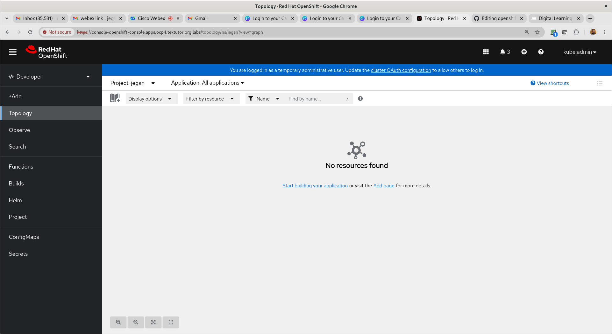
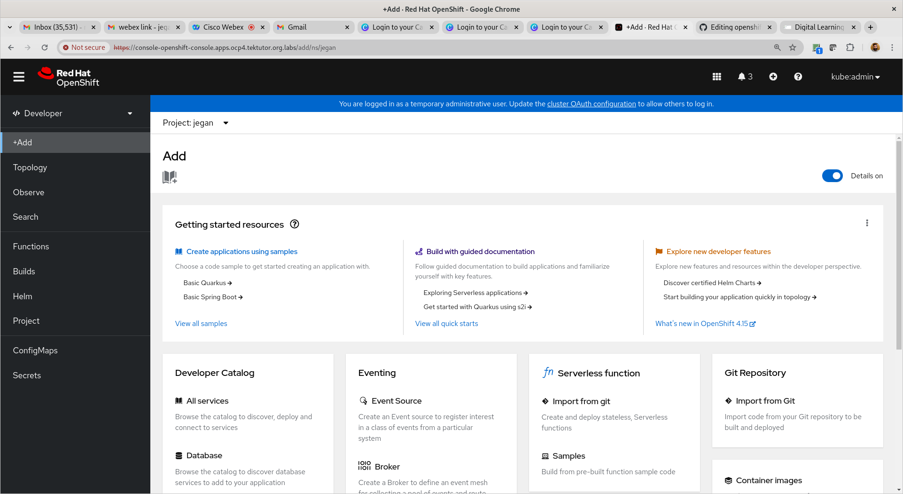
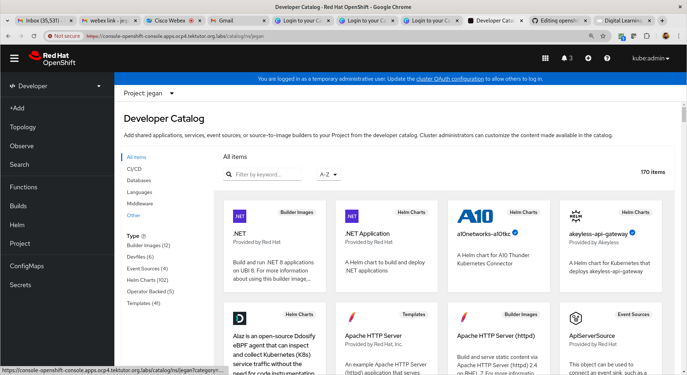
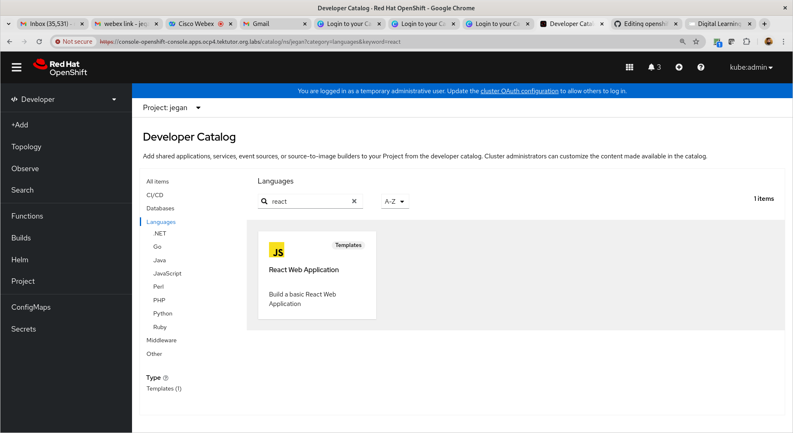
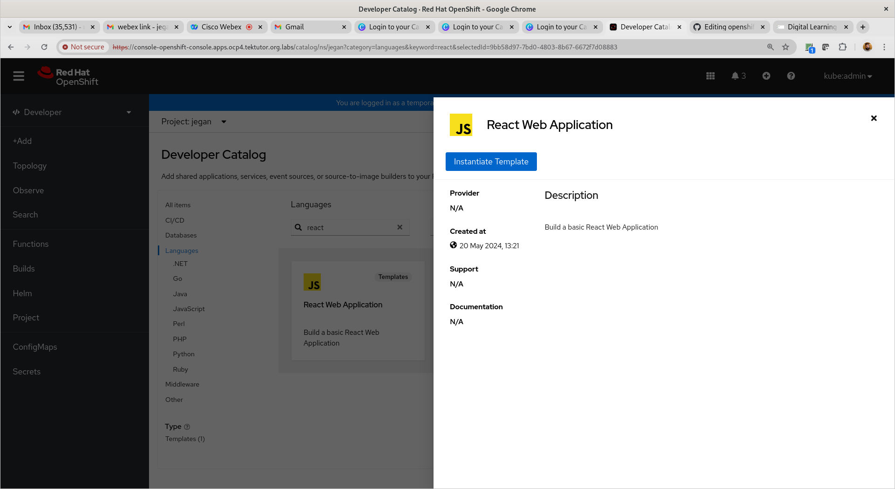
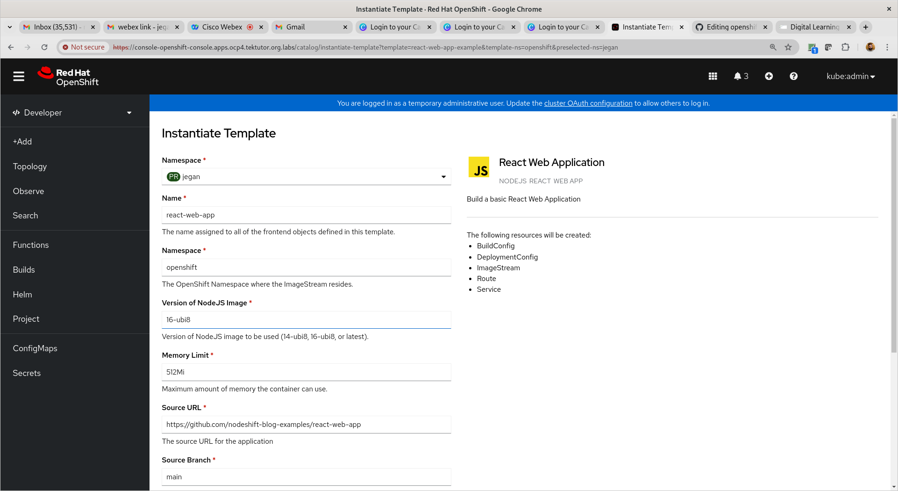
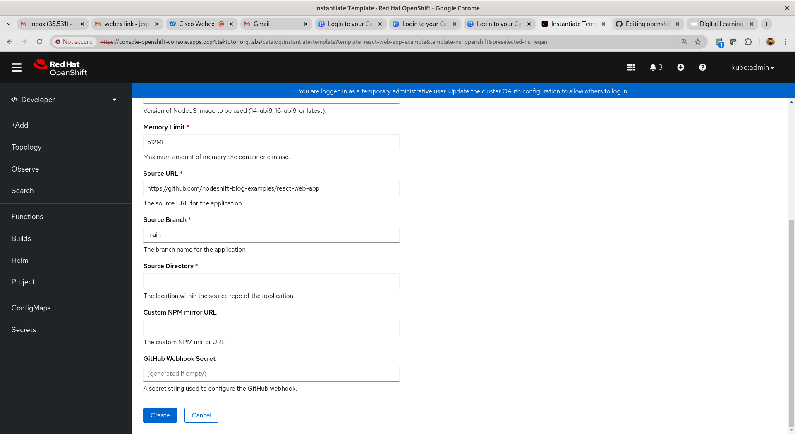
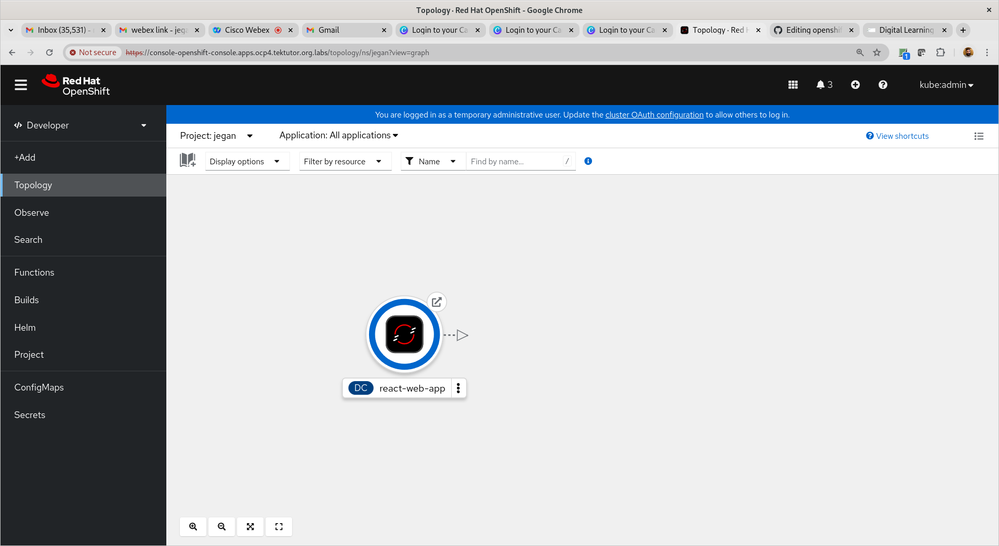
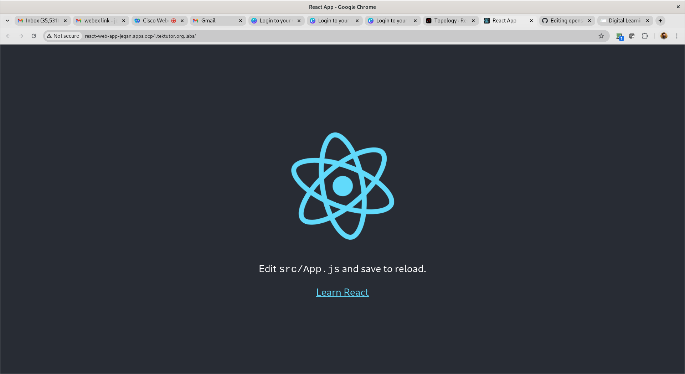

## Lab - Deploying a Java springboot application from GitHub source code into Openshift
```
oc new-app https://github.com/tektutor/spring-ms.git --strategy=docker
oc expose svc/spring-ms
oc get bc
oc logs -f bc/spring-ms
```

Expected output
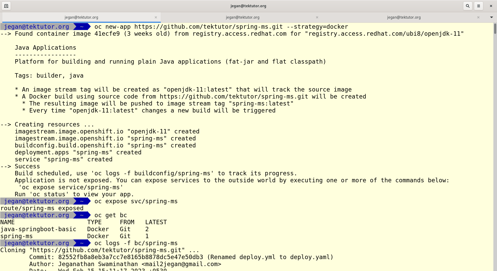
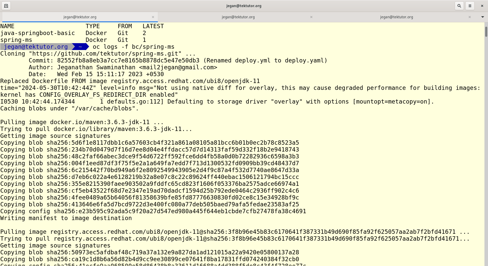
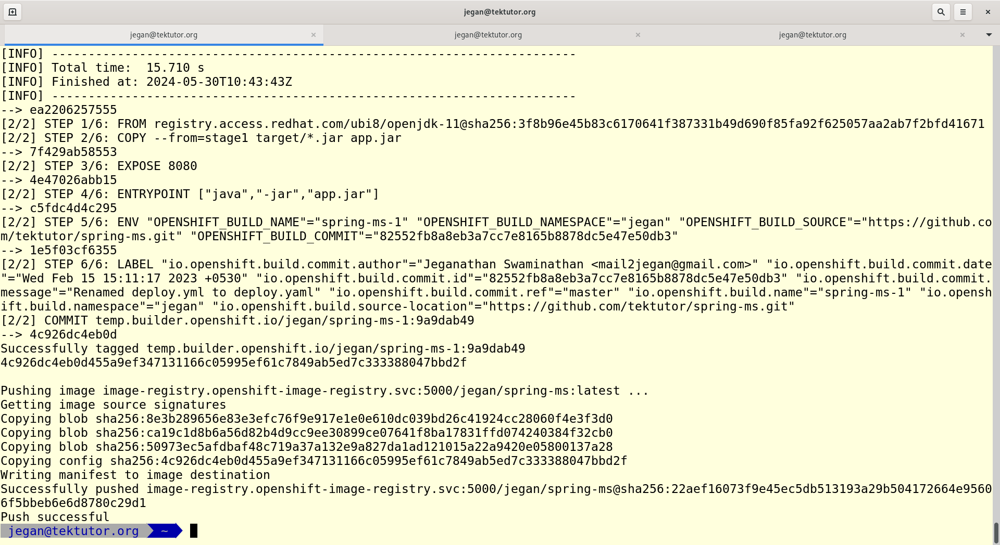


## Info - Installing openssl ( is already installed in our lab - just for your future reference )

Installing openssl from source code ( Already installed on Lab machines, so kindly skip this installation)
```
sudo yum -y remove openssl openssl-devel
sudo yum groupinstall 'Development Tools'
sudo yum install perl-IPC-Cmd perl-Test-Simple -y
cd /usr/src
wget https://www.openssl.org/source/openssl-3.0.0.tar.gz
tar -zxf openssl-3.0.0.tar.gz
rm openssl-3.0.0.tar.gz
cd /usr/src/openssl-3.0.0
./config
make
make test
make install

sudo ln -s /usr/local/lib64/libssl.so.3 /usr/lib64/libssl.so.3
sudo ln -s /usr/local/lib64/libcrypto.so.3 /usr/lib64/libcrypto.so.3

sudo ldconfig
sudo tee /etc/profile.d/openssl.sh<<EOF
export PATH=/usr/local/bin:$PATH
export LD_LIBRARY_PATH=/usr/local/openssl/lib:/usr/local/openssl/lib64:$LD_LIBRARY_PATH
EOF

which openssl
openssl version
```


## Lab - Create an edge route ( https url )
You can secure your routes with https(secured) as url as opposed to http(unsecured).

## Lab - Create an edge route (https based public route url)

Find your base domain of your openshift cluster
```
oc get ingresses.config/cluster -o jsonpath={.spec.domain}
```

Expected output
<pre>
[root@tektutor.org auth]# oc get ingresses.config/cluster -o jsonpath={.spec.domain}
apps.ocp.tektutor.org.labs	
</pre>

Let's deploy a microservice and create an edge route as shown below.

First, let's generate a private key
```
openssl genrsa -out key.key
```

We need to create a public key using the private key with specific with your organization domain
```
openssl req -new -key key.key -out csr.csr -subj="/CN=hello-jegan.apps.ocp.tektutor.org.labs"
```

Sign the public key using the private key and generate certificate(.crt)
```
openssl x509 -req -in csr.csr -signkey key.key -out crt.crt
oc create route edge --service spring-ms --hostname hello-jegan.apps.ocp4.tektutor.org.labs --key key.key --cert crt.crt
```

Expected output
<pre>
[jegan@tektutor.org edge-route]$ oc get svc
NAME        TYPE        CLUSTER-IP      EXTERNAL-IP   PORT(S)    AGE
spring-ms   ClusterIP   172.30.208.33   <none>        8080/TCP   87m
[jegan@tektutor.org edge-route]$ oc expose deploy/nginx --port=8080
service/nginx exposed
  
[jegan@tektutor.org edge-route]$ oc get svc
NAME        TYPE        CLUSTER-IP      EXTERNAL-IP   PORT(S)    AGE
nginx       ClusterIP   172.30.16.165   <none>        8080/TCP   4s
spring-ms   ClusterIP   172.30.208.33   <none>        8080/TCP   87m

[jegan@tektutor.org edge-route]$ oc get ingresses.config/cluster -o jsonpath={.spec.domain}
apps.ocp4.tektutor.org.labs
  
[jegan@tektutor.org edge-route]$ oc project
Using project "jegan-devops" on server "https://api.ocp4.tektutor.org.labs:6443".
  
[jegan@tektutor.org edge-route]$ openssl req -new -key key.key -out csr.csr -subj="/CN=nginx-jegan-devops.apps.ocp4.tektutor.org.labs"
  
[jegan@tektutor.org edge-route]$ openssl x509 -req -in csr.csr -signkey key.key -out crt.crt
  
[jegan@tektutor.org edge-route]$ oc create route edge --service nginx --hostname nginx-jegan-devops.apps.ocp4.tektutor.org.labs --key key.key --cert crt.crt
route.route.openshift.io/nginx created
  
[jegan@tektutor.org edge-route]$ oc get route
NAME    HOST/PORT                                        PATH   SERVICES   PORT    TERMINATION   WILDCARD
nginx   nginx-jegan-devops.apps.ocp4.tektutor.org.labs   nginx      <all>   edge          None
</pre>

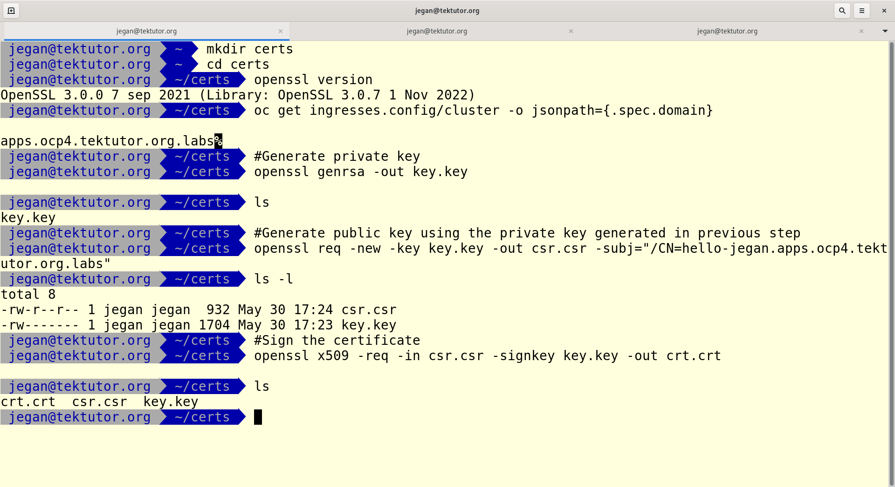
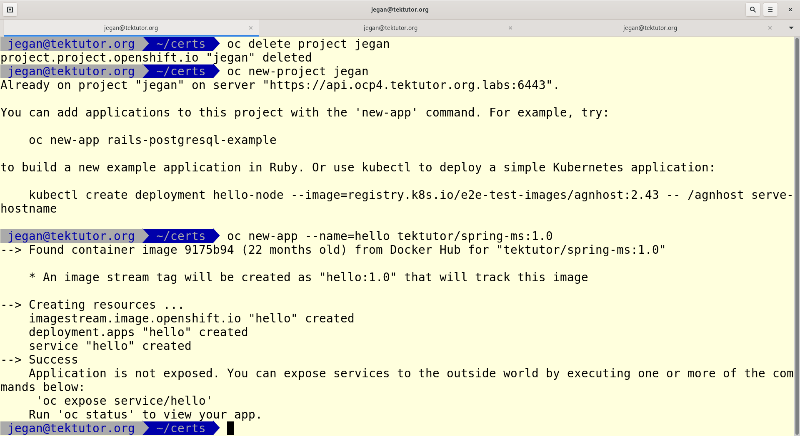
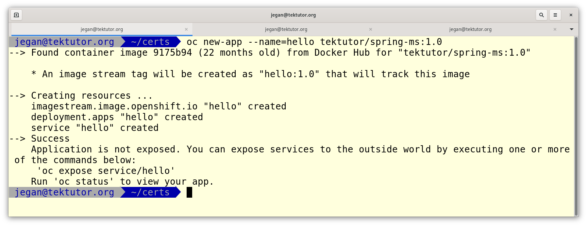
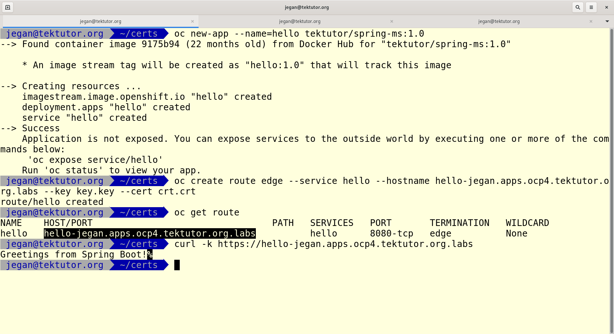
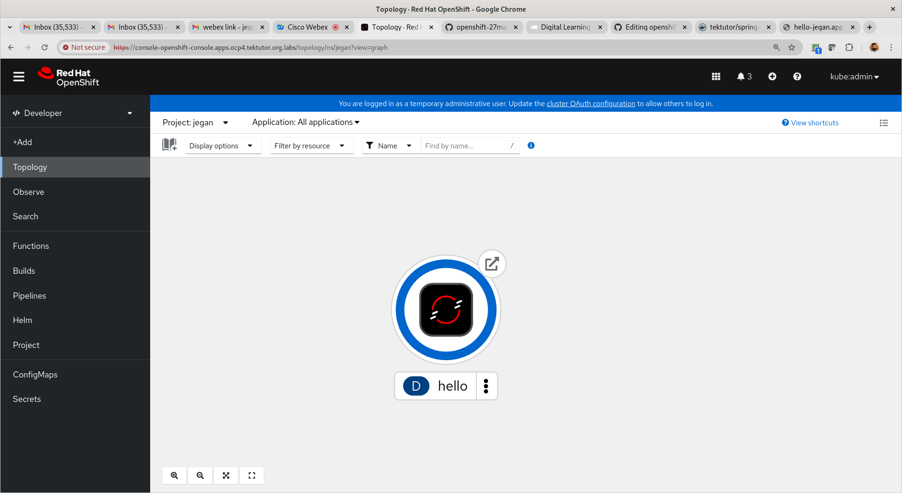
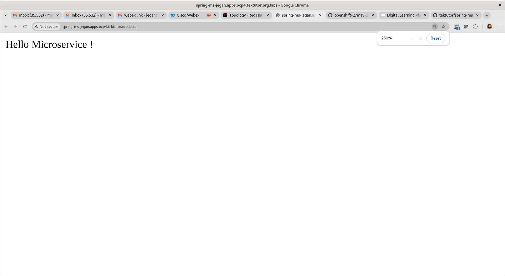

## Lab - Deploying multi-pod PHP application


## Info - OpenShift Network Model

#### What is Flannel?

#### What is Calico?

#### What is Weave?


## What is edge route?
