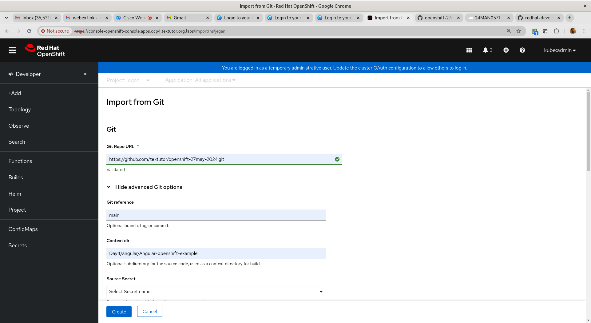
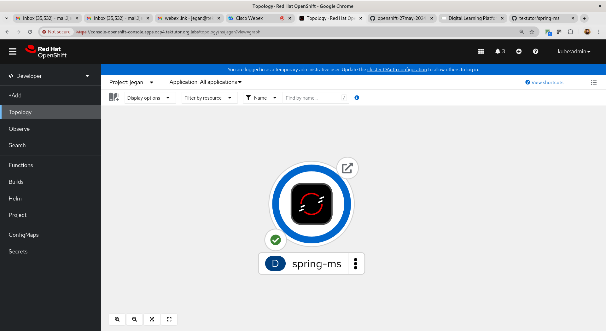

# Day 4

## Info - How to see the values stored inside etcd database?
```
oc exec -it etcd-master01.ocp4.rps.com -c etcdctl -n openshift-etcd sh
etcdctl get "/kubernetes.io/pods/jegan" --prefix=true
etcdctl get "/kubernetes.io/deployments/jegan/nginx" --prefix=true
exit
```

## Info - What is an Openshift Job?
- any one-time activity we can create them as a Job
- Example
  - delete all Persistent Volume which are unused
  - taking backup of etcd database

## Info - What is an Openshift CronJob?
- any recurring activity but that will run for few minutes and terminate we can run them as a CronJob
- Example
  - taking backup of etcd database every Sunday midnight

## Lab - Create a one-time job
```
cd ~/openshift-27may-2024
git pull
cd Day4/job
oc apply -f job.yml
oc get jobs
oc get pods
oc logs job/hello-job
```

Once you are done with the exercise, you may cleanup the resources
```
cd ~/openshift-sep-2024
cd Day4/job
oc delete -f job.yml
```

## Lab - Create a recurring job using Cronjob

```
cd ~/openshift-sep-2024
git pull
cd Day4/cronjob
oc apply -f cronjob.yml
oc get cronjobs
oc get po -w
oc logs cronjobs/cron-job
```

Once you are done with this exercise, you may delete the cronjob
```
cd ~/openshift-sep-2024
cd Day4/cronjob

oc delete -f cronjob.yml
```

## Info - What is DeploymentConfig?
- In older versions of Kubernetes to deploy stateless application we had to use ReplicationController
- In Red Hat they wanted to support declarative style while scaling and while performing rolling update, hence they add a new type of custom resource in OpenShift called DeploymentConfig
- ReplicationController supports both Scaling and rolling update, which is not a good design as it does more than one thing ( against SRP SOLID Design Priniciple )
- DeploymentConfig helps us deploy stateless applications
- Meanwhile, Google refactored the ReplicationController into two resources
  - 1. Deployment - which takes care of Rolling update
    2. ReplicaSet - which takes care of scaling up/down
- As per SOLID Design Priniciples
  - S - Single Responsibility Principle (SRP)
  - O - Open Closed Principle (OCP)
  - L - Liskov Substitution Principle
  - I - Interface Seggration
  - D - Dependency Injection or Dependency Inversion or Inversion of Control (IOC)
- By the Kubernetes added Deployment & ReplicaSet as an alternate to ReplicationController, the OpenShift team already added Deployment Config
- In new versions of OpenShift we would see
  - Deployment & ReplicaSet
  - DeploymentConfig ( this was introduced in openshift when there was no Deployment & ReplicaSet, hence we should avoid using DeploymentConfig instead we should use Deployment )
  - ReplicationController ( old kubernetes features now ideally we should use Deployment )

## Lab - Deploying Angular application from OpenShift Webconsole using Developer context




## Lab - Deploying ReactJS application in Openshift from webconsole


## Lab - Deploying a Java springboot application from GitHub source code into Openshift
```
oc new-app https://github.com/tektutor/spring-ms.git --strategy=docker
oc expose svc/spring-ms
oc get bc
oc logs -f bc/spring-ms
```

Expected output





## Info - Installing openssl ( is already installed in our lab - just for your future reference )

Installing openssl from source code ( Already installed on Lab machines, so kindly skip this installation)
```
sudo yum -y remove openssl openssl-devel
sudo yum groupinstall 'Development Tools'
sudo yum install perl-IPC-Cmd perl-Test-Simple -y
cd /usr/src
wget https://www.openssl.org/source/openssl-3.0.0.tar.gz
tar -zxf openssl-3.0.0.tar.gz
rm openssl-3.0.0.tar.gz
cd /usr/src/openssl-3.0.0
./config
make
make test
make install

sudo ln -s /usr/local/lib64/libssl.so.3 /usr/lib64/libssl.so.3
sudo ln -s /usr/local/lib64/libcrypto.so.3 /usr/lib64/libcrypto.so.3

sudo ldconfig
sudo tee /etc/profile.d/openssl.sh<<EOF
export PATH=/usr/local/bin:$PATH
export LD_LIBRARY_PATH=/usr/local/openssl/lib:/usr/local/openssl/lib64:$LD_LIBRARY_PATH
EOF

which openssl
openssl version
```

## Lab - Create an edge route ( https url )
You can secure your routes with https(secured) as url as opposed to http(unsecured).

## Lab - Create an edge route (https based public route url)

Find your base domain of your openshift cluster
```
oc get ingresses.config/cluster -o jsonpath={.spec.domain}
```

Expected output
<pre>
[root@tektutor.org auth]# oc get ingresses.config/cluster -o jsonpath={.spec.domain}
apps.ocp.tektutor.org.labs	
</pre>

Let's deploy a microservice and create an edge route as shown below.

First, let's generate a private key
```
openssl genrsa -out key.key
```

We need to create a public key using the private key with specific with your organization domain
```
openssl req -new -key key.key -out csr.csr -subj="/CN=hello-jegan.apps.ocp.tektutor.org.labs"
```

Sign the public key using the private key and generate certificate(.crt)
```
openssl x509 -req -in csr.csr -signkey key.key -out crt.crt
oc create route edge --service spring-ms --hostname hello-jegan.apps.ocp4.tektutor.org.labs --key key.key --cert crt.crt
```

Expected output
<pre>
[jegan@tektutor.org edge-route]$ oc get svc
NAME        TYPE        CLUSTER-IP      EXTERNAL-IP   PORT(S)    AGE
spring-ms   ClusterIP   172.30.208.33   <none>        8080/TCP   87m
[jegan@tektutor.org edge-route]$ oc expose deploy/nginx --port=8080
service/nginx exposed
  
[jegan@tektutor.org edge-route]$ oc get svc
NAME        TYPE        CLUSTER-IP      EXTERNAL-IP   PORT(S)    AGE
nginx       ClusterIP   172.30.16.165   <none>        8080/TCP   4s
spring-ms   ClusterIP   172.30.208.33   <none>        8080/TCP   87m

[jegan@tektutor.org edge-route]$ oc get ingresses.config/cluster -o jsonpath={.spec.domain}
apps.ocp4.tektutor.org.labs
  
[jegan@tektutor.org edge-route]$ oc project
Using project "jegan-devops" on server "https://api.ocp4.tektutor.org.labs:6443".
  
[jegan@tektutor.org edge-route]$ openssl req -new -key key.key -out csr.csr -subj="/CN=nginx-jegan-devops.apps.ocp4.tektutor.org.labs"
  
[jegan@tektutor.org edge-route]$ openssl x509 -req -in csr.csr -signkey key.key -out crt.crt
  
[jegan@tektutor.org edge-route]$ oc create route edge --service nginx --hostname nginx-jegan-devops.apps.ocp4.tektutor.org.labs --key key.key --cert crt.crt
route.route.openshift.io/nginx created
  
[jegan@tektutor.org edge-route]$ oc get route
NAME    HOST/PORT                                        PATH   SERVICES   PORT    TERMINATION   WILDCARD
nginx   nginx-jegan-devops.apps.ocp4.tektutor.org.labs   nginx      <all>   edge          None
</pre>


## Info - OpenShift Network Model

#### What is Flannel?

#### What is Calico?

#### What is Weave?

## What is edge route?

## Info - Persistent Volume Overview
<pre>
- any application that stores/retrieves data they could either use the Pod storage or external storage
- as the Pod's life time is short, storing the permanent data in a short lived Pod doesn't sound correct
- hence, it is considered a bad practice to modify a pod once it is created
- as per devops philosophy, we must use containers, Pods like an immutable(read-only) resource, though it is mutable
- hence, we should be using some external storage to persistent our application logs, database, etc
- Openshift Administrators can provision external storage either manually or dynamically
- In case the Administrators prefer povisioning the Persistent Volume(storage) manually, they need to create PV with various size, access permissions, etc as per dev/qa/operation team's requirement
- The Persistent Volume (PV storage) can be provisioned
  - from NFS Server ( we would be using NFS Server )
  - Some storage solution in on-premise environment
  - could use AWS S3 buckets, AWS EBS, Azure Storage, etc.
- the Persistent Volume will have the below parameters
  - disk size
  - access mode
  - storageclass(optional)
  - labels(optional)
- Persistent volumes are created in the cluster scope
</pre>

## Info - Persistent Volume Claim Overview
<pre>
- application Pods are created within a project, hence the PVC is also created within a project 
- any application (Pod) that needs storage will have to ask Openshift by creating a Peristent Volume Claim
- the PVC will define the below
  - size of the storage required
  - access mode expected
  - storageclass(optional)
  - any label restrictions (optional)
- openshift will search the cluster for a matching Persistent Volume and if it finds a matching PV, it let's your application claim and use it
- in case openshift is not able to find a matching Persistent Volume against a Persistent Volume Claim, the Pod will be kept in Pending state as it won't be able to proceed without storage(PVC--->PV)
</pre>

## Lab - Deploying multipod application Wordpress with MariaDB database
```
cd ~/openshift-sep-2024
git pull
cd Day3/persistent-volume/wordpress
ls
./deploy.sh
```
Expected output


## Info - StatefulSet Overview
<pre>
- Deployment is an Openshift/Kubernetes component through which we deploy stateless applications
- StatefulSet is an Openshift/kubernetes component through which we deply stateful applications
- Deployment
  - supports Persistent Volume and Persistent Volume Claims
  - each Pod gets a random name when Deployment is scaled up/down,hence pod names are unpredicatable
  - when scale down happens a random pod within the deployment will be deleted
  - when scaled up a new pod with random name gets added 
  - hence scaling up/down a stateless application is easy and can be achieved with Deployment
- Stateful
  - supports Persistent Volume and Persistent Voluem Claims
  - each Pod get an unique and stable identify (name)
  - let's say we create a statefulset named mysql, its first pod will be named mysql-0 which is the sticky pod identify
  - even if the mysql-0 master Pod crashes, the new pod even if runs in a different node it will be created with exact same name mysql-0. This is important otherwise the headless service that refers to mysql-0 Pod will not work
  - if mysql-1 slave Pod crashes, the new pod could be scheduled on the same/different node but its name will be mysql-1 for sure. This is important for the mysql-2 Pod as it will be dependent on mysql-1 Pod to synchronize the data
  - when a statefulset is scaled up
    - it will ensure the first pod mysql-0 is created and running successfully
    - the second pod with an unique name mysql-1 will be created
    - the third pod with an unique naem mysql-2 will be created only after ensuring mysql-1 pod is successfully runing
  - when a statefulset is scaled down
    - it is guaranteed the last pod i.e mysql-2 will be deleted first followed by mysql-1 and so on
  - allows each Pod using a separate storage(Persistent Volume and Claim)
  - ideal for creating a cluster of database Pods
  - the first pod in statefulset can be configured to act as a master, while the other Pods can be configured to act as a slave
  - while StatefulSet gives all facilities to create a cluster of database/stateful application pods, we still have to manually do the configuration required to setup a db cluster ourselves
  - creating a cluster of legacy db servers requires only the master pod ( mysql-0 ) with write access to database
  - while other slave pods ( mysql-1, mysql-2, etc., ) has only read-only access
  - the mysql-1 when created, it clones mysql-0 Pod data and then starts synchronizing in its own copy as new changes happens in mysql-0
  - the mysql-2 when created, it clones mysql-1 Pod and then starts synchronizing a new changes as it happens in mysql-1
  - generally statefulset applications gets atleast two services, one head-less service without any IP and other service which load balances between all the replicas of read-only pods
</pre>  


## Lab - Statefulset
<pre>

</pre>


## Lab - Using ConfigMap and Secrets and avoid hard coding
```
cd ~/openshift-sep-2024
git pull
cd Day4/configs-and-secrets
./deploy
```

## Info - Helm Overview
<pre>
- Helm is a package manager to download, install, uninstall, upgrade applications into Kubernetes/Openshift cluster
- Helm packaged application is called Charts
- It can be download from community maintained Helm repositoyr and deploy the application into your Kubernetes/Openshift cluster
- We could also create our custom Helm charts and deploy them in Kubernetes/Openshift cluster
</pre>

## Demo - Install Helm 
```
curl -fsSL -o get_helm.sh https://raw.githubusercontent.com/helm/helm/main/scripts/get-helm-3
chmod 700 get_helm.sh
./get_helm.sh
```


## Lab - Creating a Helm chart for wordpress with mariadb and deploy it in our Openshift cluster
```
helm version
helm create wordpress
tree wordpress
```

Expected output


Create a helm package
```
tree wordpress
```

Expected output


