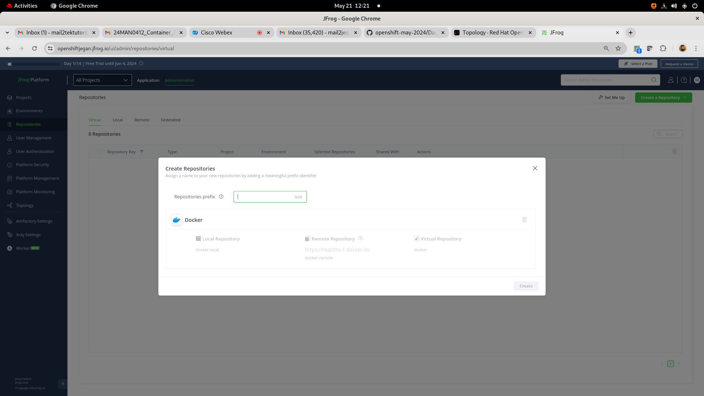

# Day 5

## Lab - Creating an edge route for nginx deployment

Let's deploy nginx inside a project
```
oc new-project jegan
oc create deployment nginx --image=bitnami/nginx:latest --replicas=3
oc expose deploy/nginx --port=8080
```

Find your base domain of your openshift cluster
```
oc get ingresses.config/cluster -o jsonpath={.spec.domain}
```

Let's generate a private key
```
openssl version
openssl genrsa -out key.key
```

We need to create a public key using the private key with specific with your organization domain
```
openssl req -new -key key.key -out csr.csr -subj="/CN=nginx-jegan.apps.ocp4.tektutor.org.labs"
```

Sign the public key using the private key and generate certificate(.crt)
```
openssl x509 -req -in csr.csr -signkey key.key -out crt.crt
oc create route edge --service nginx --hostname nginx-jegan.apps.ocp4.tektutor.org.labs --key key.key --cert crt.crt
```

Expected output

## Lab - Creating a JFrog Artifactory 14 days cloud trial

You need to create a trial JFrog Artifactory (14-days Cloud Trial) @ https://jfrog.com/start-free/#trialOptions with your personal gmail account (No credit cards required)


You could choose AWS ( they use their cloud account hence no charges are applicable to us - I didn't give my mobile number )


Now you should be able to login to your jfrog cloud with your gmail account that your registered with JFrog trial





<pre>
jegan@tektutor.org $ docker login -umail2tektutor@gmail.com openshiftjegan.jfrog.io
Password: 
WARNING! Your password will be stored unencrypted in /home/jegan/.docker/config.json.
Configure a credential helper to remove this warning. See
https://docs.docker.com/engine/reference/commandline/login/#credentials-store

Login Succeeded
 jegan@tektutor.org % docker pull openshiftjegan.jfrog.io/jegan-docker/hello-world:latest
latest: Pulling from jegan-docker/hello-world
Digest: sha256:266b191e926f65542fa8daaec01a192c4d292bff79426f47300a046e1bc576fd
Status: Downloaded newer image for openshiftjegan.jfrog.io/jegan-docker/hello-world:latest
openshiftjegan.jfrog.io/jegan-docker/hello-world:latest
	
jegan@tektutor.org $ docker tag openshiftjegan.jfrog.io/jegan-docker/hello-world openshiftjegan.jfrog.io/jegan-docker/hello-world:1.0.0
	
jegan@tektutor.org $ docker push openshiftjegan.jfrog.io/jegan-docker/hello-world:1.0.0
The push refers to repository [openshiftjegan.jfrog.io/jegan-docker/hello-world]
ac28800ec8bb: Layer already exists 
1.0.0: digest: sha256:d37ada95d47ad12224c205a938129df7a3e52345828b4fa27b03a98825d1e2e7 size: 524
</pre>

# Bonus Labs (Optional - not in our training agenda)

## Lab - Finding more details about Openshift Private Image Registry
Red Hat Openshift comes with a private Container Registry out of the box.  You may try extracting more details about the openshift image registry as shown below

```
oc describe svc/image-registry -n openshift-image-registry
```

Expected output
<pre>
[jegan@tektutor.org] $ oc describe svc/image-registry -n openshift-image-registry
Name:              image-registry
Namespace:         openshift-image-registry
Labels:            docker-registry=default
Annotations:       imageregistry.operator.openshift.io/checksum: sha256:1c19715a76014ae1d56140d6390a08f14f453c1a59dc36c15718f40c638ef63d
                   service.alpha.openshift.io/serving-cert-secret-name: image-registry-tls
                   service.alpha.openshift.io/serving-cert-signed-by: openshift-service-serving-signer@1710727234
                   service.beta.openshift.io/serving-cert-signed-by: openshift-service-serving-signer@1710727234
Selector:          docker-registry=default
Type:              ClusterIP
IP Family Policy:  SingleStack
IP Families:       IPv4
IP:                172.30.193.120
IPs:               172.30.193.120
Port:              5000-tcp  5000/TCP
TargetPort:        5000/TCP
Endpoints:         10.128.0.38:5000
Session Affinity:  None
Events:            <none>  
</pre>

## Lab - In case you are curious to see how does the etcd key/value data-store stores the data in openshift
In the below commands, replace 'jegan' with your project name(your name)

```
oc project openshift-etcd
oc rsh po/etcd-master-1.ocp4.rps.com
etcdctl get "" --keys-only --prefix=true
etcdctl get "" --keys-only --prefix=true | grep jegan
etcdctl get "/kubernetes.io/deployments/jegan/mariadb" --prefix=true
etcdctl get "/kubernetes.io/pods/jegan/mariadb-8469c94c8b-tf65s" --prefix=true
```

## Lab - Deploying a multipod java application that fetches data from mariadb database
```
cd ~/openshift-sep-2024
git pull

cd Day5/hello-microservice
mvn clean package

oc apply -f configmap.yml
oc apply -f secrets.yml
oc apply -f mariadb-pv.yml
oc apply -f mariadb-pvc.yml
oc apply -f mariadb-deploy.yml
oc apply -f mariadb-svc.yml

oc apply -f openshift-helloms-deploy.yml
oc apply -f openshift-helloms-svc.yml
oc apply -f openshift-helloms-route.yml
```

You can connect to mariadb pod shell as shown below, when it prompts for password type 'root@123'
```
oc rsh pod/mariadb-7889ddc665-9kskb
mysql -u root -p
CREATE DATABASE tektutor;
USE tektutor;
CREATE TABLE greeting ( message VARCHAR(100) NOT NULL );
INSERT INTO greeting VALUES ( "Hello Microservice 1.0 !" );
SELECT * FROM greeting;
```

Now you should be able to access the openshift helloms route from cli or web browser.  You need to use your route url which might look like http://openshift-hello-ms-<your-name>.apps.ocp4.rps.com
```
oc get route
curl http://openshift-hello-ms-jegan.apps.ocp4.rps.com
