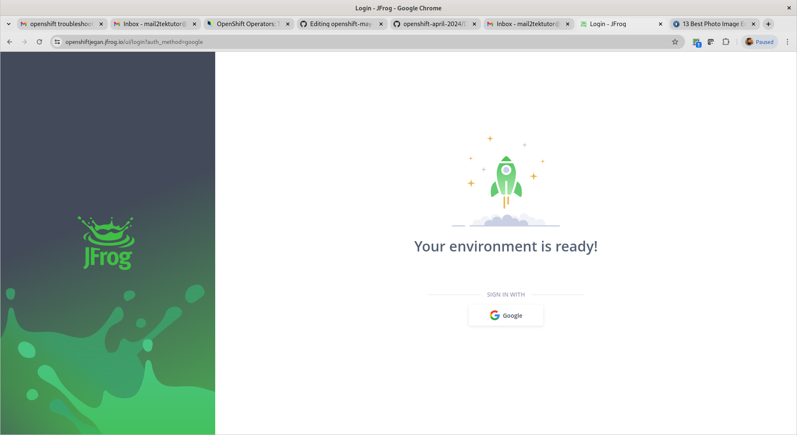
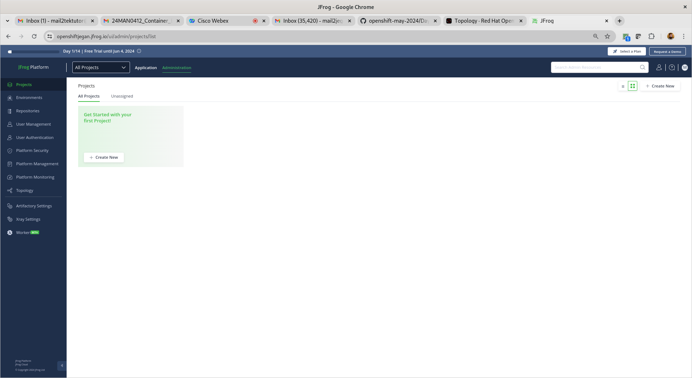
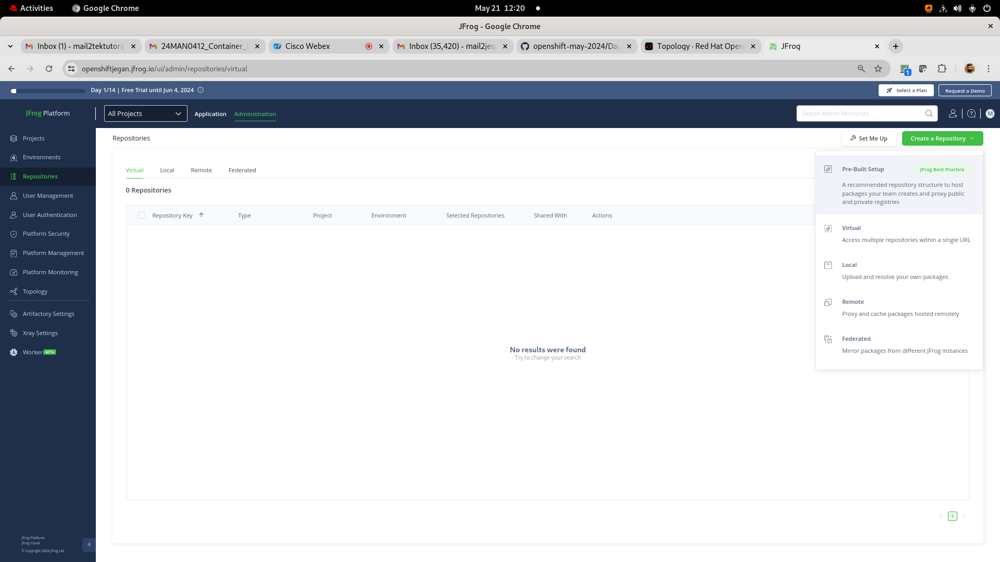
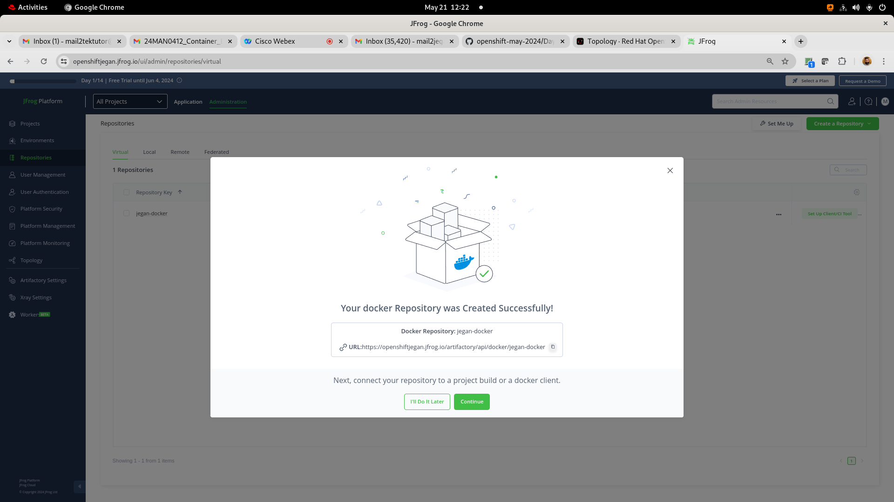

# Day 5

## Lab - Creating an edge route for nginx deployment

Let's deploy nginx inside a project
```
oc new-project jegan
oc create deployment nginx --image=bitnami/nginx:latest --replicas=3
oc expose deploy/nginx --port=8080
```

Find your base domain of your openshift cluster
```
oc get ingresses.config/cluster -o jsonpath={.spec.domain}
```

Let's generate a private key
```
openssl version
openssl genrsa -out key.key
```

We need to create a public key using the private key with specific with your organization domain
```
openssl req -new -key key.key -out csr.csr -subj="/CN=nginx-jegan.apps.ocp4.tektutor.org.labs"
```

Sign the public key using the private key and generate certificate(.crt)
```
openssl x509 -req -in csr.csr -signkey key.key -out crt.crt
oc create route edge --service nginx --hostname nginx-jegan.apps.ocp4.tektutor.org.labs --key key.key --cert crt.crt
```

Expected output

## Info - What is Continuous Integration?
<pre>
- Jenkins - is a CI Build Server
- We can create a Jenkins Job - to monitor code commits done in GitHub/BitBucket or any version control
- Whenever Jenkins detects code commit in the version control, it will start the build
- As part of the CI Build, it will first clone the latest source code from GitHub/BitBucket code repository
- Then it will start the application build (maven build, dotnet build)
- As part of the build, you also have to have some automated test cases which runs part of the build
- If any test cases fails, the build will also fail
- If code is compiling and all test cases are executed successfully then the build will succeed.
</pre>

## Info - What is Continuous Deployment?
<pre>
- the dev team certified CI builds, will automatically deploy the application binaries into QA environment for further automated testing
- if all the automated test cases added by QA team succeeds then the build is good to go live in production
- it might require some manual approvals
</pre>

## Info - What is Continuous Delivery?
<pre>
- the QA certified build will automatically be deployed into pre-prod environment for the customer to check and approve to decide to make them live in production  
</pre>

## Info - What is a Jenkins CI/CD Job?
<pre>
- could build application source and run automated test cases
- could build custom docker images
- could deploy application binaries to JFrog, Weblogic or JBoss
- could deploy application into Openshift
</pre>  

## Info - What is Jenkins Pipeline?
<pre>
- Pipelines involves many Jenkins Job that run one after the other in sequence or in parallel
- Pipelines consists of many Stages
- Each Stage will have one Jenkins Job
- When the First Stage Job succeeds it will trigger next downstream jenkins job in the pipeline
- If the second stage Job succeeds it will trigger the next downstream jenkins job in the pipeline
- this goes on until all the jobs complete successfully
- if any one of the stage fails, it won't trigger the next downstream jenkins job and the build will fail
</pre>


## Lab - Creating a JFrog Artifactory 14 days cloud trial

You need to create a trial JFrog Artifactory (14-days Cloud Trial) @ https://jfrog.com/start-free/#trialOptions with your personal gmail account (No credit cards required)


You could choose AWS ( they use their cloud account hence no charges are applicable to us - I didn't give my mobile number )




Now you should be able to login to your jfrog cloud with your gmail account that your registered with JFrog trial








<pre>
jegan@tektutor.org $ docker login -umail2tektutor@gmail.com openshiftjegan.jfrog.io
Password: 
WARNING! Your password will be stored unencrypted in /home/jegan/.docker/config.json.
Configure a credential helper to remove this warning. See
https://docs.docker.com/engine/reference/commandline/login/#credentials-store

Login Succeeded
 jegan@tektutor.org % docker pull openshiftjegan.jfrog.io/jegan-docker/hello-world:latest
latest: Pulling from jegan-docker/hello-world
Digest: sha256:266b191e926f65542fa8daaec01a192c4d292bff79426f47300a046e1bc576fd
Status: Downloaded newer image for openshiftjegan.jfrog.io/jegan-docker/hello-world:latest
openshiftjegan.jfrog.io/jegan-docker/hello-world:latest
	
jegan@tektutor.org $ docker tag openshiftjegan.jfrog.io/jegan-docker/hello-world openshiftjegan.jfrog.io/jegan-docker/hello-world:1.0.0
	
jegan@tektutor.org $ docker push openshiftjegan.jfrog.io/jegan-docker/hello-world:1.0.0
The push refers to repository [openshiftjegan.jfrog.io/jegan-docker/hello-world]
ac28800ec8bb: Layer already exists 
1.0.0: digest: sha256:d37ada95d47ad12224c205a938129df7a3e52345828b4fa27b03a98825d1e2e7 size: 524
</pre>

## What makes the Serveless architecture work in Openshift or Kubernetes
<pre>
- You need to install OpenShift Serverless Operator
- The Serverless Operator installs knative serverless framework
</pre>

## Knative and Red Hat Servless
<pre>
- Red Hat Serverless is based on Knative opensource project
- Knative provides a serverless application layer on top of OpenShift/Kubernetes
- Knative consists of 3 building blocks
  - Build
  - Eventing
  - Serving
</pre>  

## What does Serverless mean ?
<pre>
- serverless doesn not mean the absence of servers
- is an architecture model for running applications in an environment that is abstracted away from developers
- developers can focus more on developing their application that where their code runs
- an ideal serverless workload executes a single task
- a function that retrieves data from a database can be an execellent serverless workload
- serverless model is the idea of the cold start
- when using serverless, there is a period between the request and creating the pod environment.  This period is called cold start.
- Examples
  - openshift serverless workloads follow this workflow
    - a request comes in
    - a pod is spun up to service the request
    - the serves the request
    - the pod is destroy when there is no user traffic to handle
    - your service will be scaled down all the way upto 0 pod when there is 0 zero
  - Another example of a serverless workload can be an image processing function
    - an event could be a photo upload. The uploaded photo triggers an event to run an application to process the image
    - For example, the application may overtext text, create a banner, or make thumbnail
    - Once the image is stored permanently, the application has served its purpose and is no longer needed
</pre>

## Serverless Features
<pre>
- Stateless Function
  - a function to query a database and return the data
  - a function to query weather report and return the data
- Event Driven
  - a serverless model relies on a trigger to execute the code
  - could be a request to an API or an event on a queue
- Auto Scales to zero
  - Being able to scale to zero means your code only runs when it needs to respond to an event
  - once the request is serverd, resources are release
</pre>

## Lab - Deploying your first knative service
```
kn service create hello \
--image ghcr.io/knative/helloworld-go:latest \
--port 8080
--env TARGET=World
```

Accessing the knative application from command line
```
curl -k https://hello-jegan-serverless.apps.ocp4.tektutor.org.labs
```

Expected output

#### Update the service
```
kn service update hello --env TARGET=Knative!
kn revisions list
```

Accessing the knative application from command line
```
curl -k https://hello-jegan-serverless.apps.ocp4.tektutor.org.labs
```


Expected output

Splitting the traffic between two revisions
```
kn service update hello --traffic hello-00001=50 --traffic @latest=50
kn revisions list
```
Expected output


Delete the knative service
```
kn service list
kn service delete hello
kn service list
```

Expected output

## Lab - Knative eventing

Let's deploy a sink service
```
oc project jegan-serverless
kn service create eventinghello --concurrency-target=1 --image=quay.io/rhdevelopers/eventinghello:0.0.2
```

Expected output

Let's create an event source application
```
kn source ping create eventinghello-ping-source --schedule="*/2 * * * *" --data '{"message": "Thanks for your message"}' --sink ksvc:eventinghello
```

Expected output

## Lab - Developing a simple knative function in nodejs and deploying into Openshift cluster

This will generate a basic nodejs application in your current directory
```
kn func create -l node
```

If you wish to build your application
```
kn func build
```

If you wish to run the application locally and test it
```
kn func run
```

Deploy the nodejs application into openshift after building it
```
kn func deploy -n jegan-serverless
```

Test the knative function
```
curl -k https://functions-jegan.apps.ocp4.tektutor.org.labs
```

Expected output

# Bonus Labs (Optional - not in our training agenda)

## Lab - Finding more details about Openshift Private Image Registry
Red Hat Openshift comes with a private Container Registry out of the box.  You may try extracting more details about the openshift image registry as shown below

```
oc describe svc/image-registry -n openshift-image-registry
```

Expected output
<pre>
[jegan@tektutor.org] $ oc describe svc/image-registry -n openshift-image-registry
Name:              image-registry
Namespace:         openshift-image-registry
Labels:            docker-registry=default
Annotations:       imageregistry.operator.openshift.io/checksum: sha256:1c19715a76014ae1d56140d6390a08f14f453c1a59dc36c15718f40c638ef63d
                   service.alpha.openshift.io/serving-cert-secret-name: image-registry-tls
                   service.alpha.openshift.io/serving-cert-signed-by: openshift-service-serving-signer@1710727234
                   service.beta.openshift.io/serving-cert-signed-by: openshift-service-serving-signer@1710727234
Selector:          docker-registry=default
Type:              ClusterIP
IP Family Policy:  SingleStack
IP Families:       IPv4
IP:                172.30.193.120
IPs:               172.30.193.120
Port:              5000-tcp  5000/TCP
TargetPort:        5000/TCP
Endpoints:         10.128.0.38:5000
Session Affinity:  None
Events:            <none>  
</pre>

## Lab - In case you are curious to see how does the etcd key/value data-store stores the data in openshift
In the below commands, replace 'jegan' with your project name(your name)

```
oc project openshift-etcd
oc rsh po/etcd-master-1.ocp4.rps.com
etcdctl get "" --keys-only --prefix=true
etcdctl get "" --keys-only --prefix=true | grep jegan
etcdctl get "/kubernetes.io/deployments/jegan/mariadb" --prefix=true
etcdctl get "/kubernetes.io/pods/jegan/mariadb-8469c94c8b-tf65s" --prefix=true
```

## Lab - Deploying a multipod java application that fetches data from mariadb database
```
cd ~/openshift-sep-2024
git pull

cd Day5/hello-microservice
mvn clean package

oc apply -f configmap.yml
oc apply -f secrets.yml
oc apply -f mariadb-pv.yml
oc apply -f mariadb-pvc.yml
oc apply -f mariadb-deploy.yml
oc apply -f mariadb-svc.yml

oc apply -f openshift-helloms-deploy.yml
oc apply -f openshift-helloms-svc.yml
oc apply -f openshift-helloms-route.yml
```

You can connect to mariadb pod shell as shown below, when it prompts for password type 'root@123'
```
oc rsh pod/mariadb-7889ddc665-9kskb
mysql -u root -p
CREATE DATABASE tektutor;
USE tektutor;
CREATE TABLE greeting ( message VARCHAR(100) NOT NULL );
INSERT INTO greeting VALUES ( "Hello Microservice 1.0 !" );
SELECT * FROM greeting;
```

Now you should be able to access the openshift helloms route from cli or web browser.  You need to use your route url which might look like http://openshift-hello-ms-<your-name>.apps.ocp4.rps.com
```
oc get route
curl http://openshift-hello-ms-jegan.apps.ocp4.rps.com
